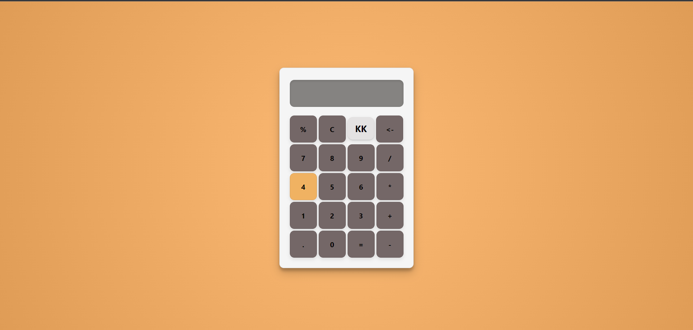

# Simple Calculator App

This is a basic calculator built with React. It provides standard arithmetic operations like addition, subtraction, multiplication, and division. The user interface is designed with simplicity in mind, making it easy for anyone to use.

 <!-- Replace 'path/to/screenshot.png' with the actual path to your screenshot if you have one -->

## Features

- Basic arithmetic operations (addition, subtraction, multiplication, division).
- Percentage calculation.
- Clean button to clear the display.
- Backspace button to correct recent entries.
- Responsive design for mobile and desktop views.

## Author
Kislay Kaushal
